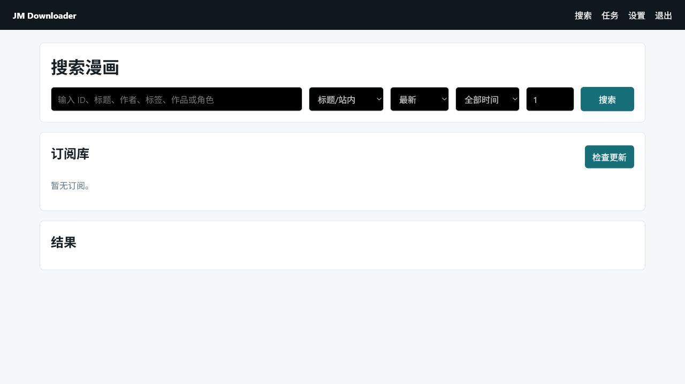
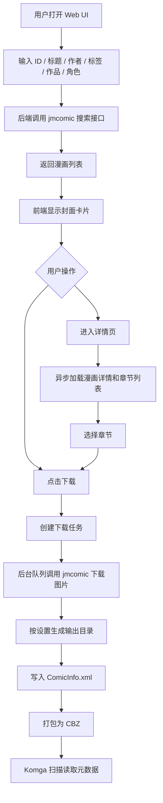
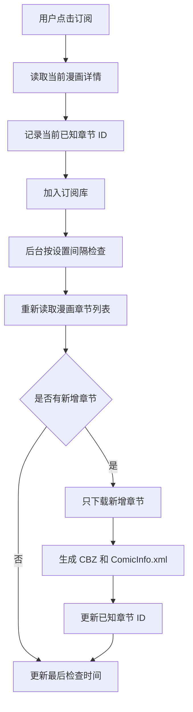
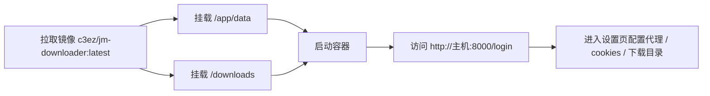

# JM Downloader

JM Downloader 是一个基于 FastAPI 的 JM天堂 下载管理网站，支持搜索漫画、选择章节下载、持续订阅更新，并将下载结果保存为适合 Komga 或者 Kavita 识别的 `.cbz` 文件。

每个 `.cbz` 内都会写入根目录级别的 `ComicInfo.xml`，方便 Komga 等漫画库读取标题、作者、标签、章节号、简介等元数据。



## API 来源

本项目不自行实现 JMComic 爬虫或解析逻辑，感谢hect0x7老师提供的api接口：

- Python 包：`jmcomic`
- 上游仓库：[hect0x7/JMComic-Crawler-Python](https://github.com/hect0x7/JMComic-Crawler-Python)
- 文档：[jmcomic ReadTheDocs](https://jmcomic.readthedocs.io)

搜索、详情、图片下载、图片解码、域名切换、客户端实现等行为都由上述上游库提供。本项目只负责 Web UI、任务队列、订阅管理、CBZ 打包和 `ComicInfo.xml` 生成。

假如某一天API失效了或者API更新了，我也许不会及时更新，欢迎提交pull

## 功能

- 支持按 ID、标题/站内关键词、作者、标签、作品、角色搜索。
- 搜索结果以封面卡片展示。
- 支持下载整本漫画或手动选择章节下载。
- 支持订阅漫画，并按设置的时间间隔检查新章节。
- 订阅更新只下载新增章节。
- 每个下载章节生成 `.cbz`，并内嵌 `ComicInfo.xml`。
- 支持在网页设置代理、cookies、域名、客户端类型、下载目录、线程数、订阅间隔等。
- 单行本可选择是否单独放入标题文件夹：
  - `downloads/标题/标题.cbz`
  - 或 `downloads/标题.cbz`

## 流程图

### 搜索与下载流程



### 订阅更新流程



### Docker 部署流程



## Docker 镜像

已发布镜像：

```text
c3ez/jm-downloader:latest
```

## 使用 docker run 启动

```powershell
docker run -d `
  --name jm-downloader `
  -p 8000:8000 `
  -e JM_ADMIN_PASSWORD=admin `
  -e JM_SESSION_SECRET=please-change-this `
  -e JM_DATA_DIR=/app/data `
  -e JM_DOWNLOAD_DIR=/downloads `
  -v ${PWD}/data:/app/data `
  -v ${PWD}/downloads:/downloads `
  c3ez/jm-downloader:latest
```

访问：

```text
http://127.0.0.1:8000/login
```

默认密码是 `admin`，建议通过 `JM_ADMIN_PASSWORD` 修改。

## 使用 Docker Compose 启动

`docker-compose.yml` 示例：

```yaml
services:
  jm-downloader:
    image: c3ez/jm-downloader:latest
    container_name: jm-downloader
    ports:
      - "8000:8000"
    environment:
      JM_ADMIN_PASSWORD: "admin"
      JM_SESSION_SECRET: "please-change-this"
      JM_DATA_DIR: "/app/data"
      JM_DOWNLOAD_DIR: "/downloads"
    volumes:
      - ./data:/app/data
      - ./downloads:/downloads
    restart: unless-stopped
```

启动：

```powershell
docker compose up -d
```

停止：

```powershell
docker compose down
```

更新：

```powershell
docker compose pull
docker compose up -d
```

## 数据卷

- `/app/data`：保存 SQLite 数据库和网页设置。
- `/downloads`：保存下载后的 CBZ 文件和可选保留的图片目录。

推荐宿主机目录结构：

```text
./data
./downloads
```

## 环境变量

| 变量 | 默认值 | 说明 |
| --- | --- | --- |
| `JM_ADMIN_PASSWORD` | `admin` | Web UI 管理员密码。 |
| `JM_SESSION_SECRET` | `change-me-in-production` | Cookie 签名密钥，部署时建议修改。 |
| `JM_DATA_DIR` | 本地为 `./data`，Docker 中为 `/app/data` | 应用数据目录。 |
| `JM_DATABASE_PATH` | `$JM_DATA_DIR/app.db` | SQLite 数据库路径。 |
| `JM_DOWNLOAD_DIR` | 本地为 `./downloads`，Docker 中为 `/downloads` | 下载输出目录。 |
| `JM_HOST` | Docker 中为 `0.0.0.0` | Uvicorn 监听地址。 |
| `JM_PORT` | `8000` | Uvicorn 监听端口。 |

代理、cookies、域名、client 类型、线程数、订阅间隔、单行本输出方式等 JM 相关设置都在网页设置页中配置。

## 本地开发运行

```powershell
python -m venv .venv
.\.venv\Scripts\Activate.ps1
pip install -r requirements.txt
uvicorn jm_downloader.main:app --host 127.0.0.1 --port 8000
```

## 本地构建镜像

```powershell
docker build -t jm-downloader:latest .
```

运行本地镜像：

```powershell
docker run --rm -p 8000:8000 jm-downloader:latest
```

发布到 Docker Hub：

```powershell
docker tag jm-downloader:latest c3ez/jm-downloader:latest
docker push c3ez/jm-downloader:latest
```

## 测试

```powershell
pip install -r requirements-dev.txt
python -m pytest
```

## 协议

本项目使用 GNU General Public License v3.0，详见 [LICENSE](LICENSE)。
